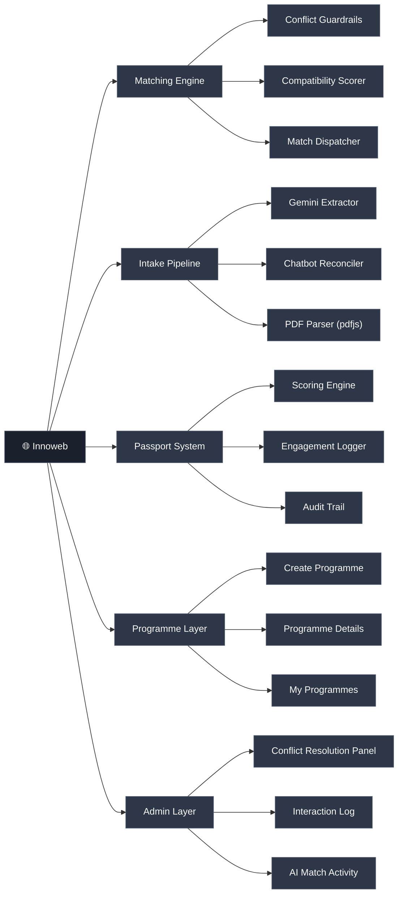
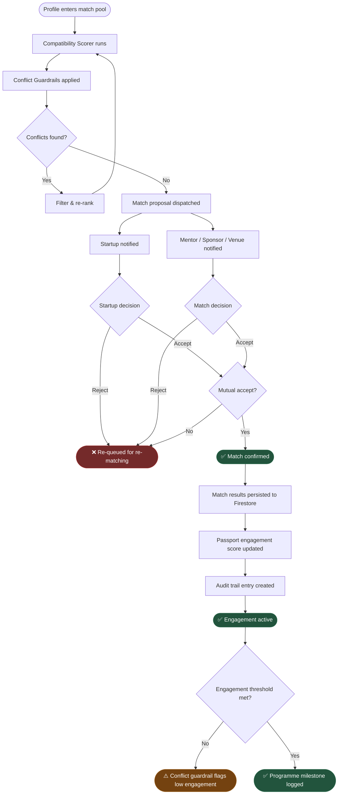
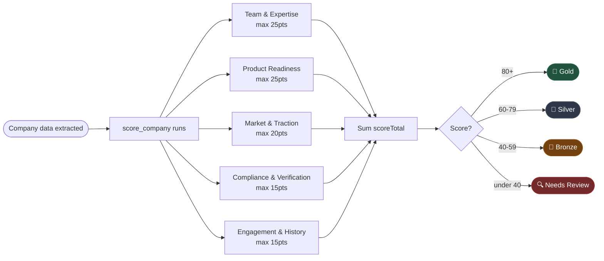
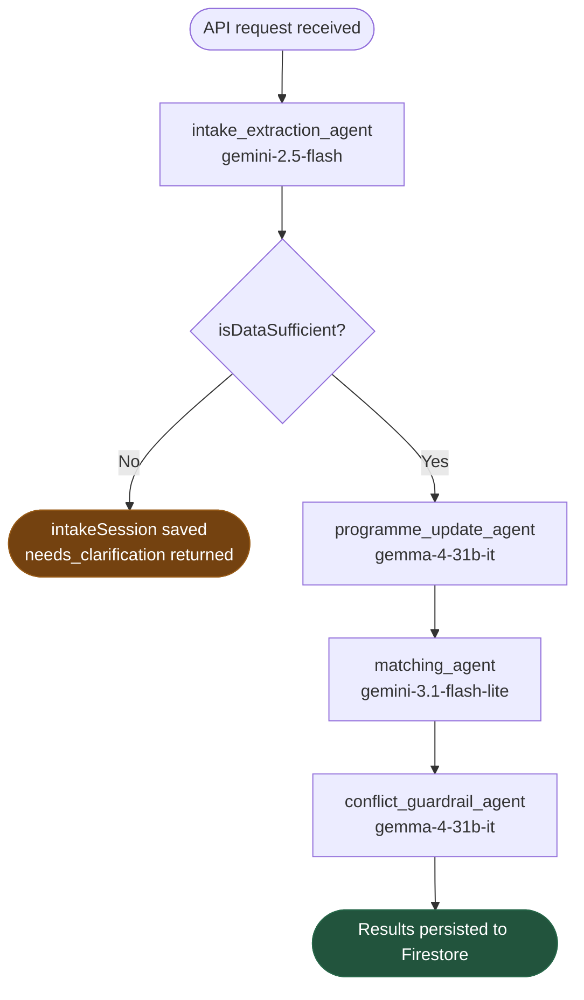

## Innoweb

**_Ecosystem relationships, automated. Matchmaking, at machine speed._**

[](https://opensource.org/licenses/MIT)
[](https://react.dev)
[](https://www.typescriptlang.org)
[](https://vitejs.dev)
[](https://firebase.google.com)
[](https://fastapi.tiangolo.com)
[](https://google.github.io/adk-docs/)
[](https://www.python.org)

[Architecture](#architecture) · [Features](#features) · [Quick Start](#quick-start) · [Project Structure](#project-structure)

`ai-matching` `p2p-ecosystem` `google-adk` `firebase` `mentor-coordination` `innovation-platform`

---

</div>

## The Problem

Innovation ecosystem platforms have no native coordination layer between _"a participant is onboarded"_ and _"a relationship is actively managed."_ This surfaces in three ways:

**Relationships are one-off.** Mentor-to-company, company-to-programme, and partner-to-initiative linkages are handled as bespoke manual tasks — not reusable, structured system entities. There is no platform memory. Every cohort starts from scratch.

**Admins are the single point of failure.** Every verification, match, and engagement update bottlenecks through one team. A model that works for 20 startups collapses at 200 and breaks entirely across geographies.

**Programs hardcode their coordination.** Platforms bake admin workflows directly into operations. Every policy change requires an operational intervention. Every programme needs the same admin overhead rebuilt from nothing.

## The Solution

Innoweb lifts coordination out of admin workflows and into programmable, automated platform entities. The matching engine resolves constraints natively. The intake pipeline self-corrects via AI chatbot. Every accepted match triggers a full communication loop with zero human steps. Relationship entities persist across cohorts and improve future matching.

**No admin in the loop. No one-off assignments. No operational ceiling.**

---

### Without Innoweb vs With Innoweb

| Scenario | Without Innoweb | With Innoweb |
|---|:---:|:---:|
| Mentor-startup matching | ✗ Admin reviews manually, delayed by days | ✓ Algorithm scores and dispatches instantly |
| Conflict of interest checks | ✗ Admin relies on notes and memory | ✓ Engine auto-filters credentials and sector overlaps |
| Participant data intake | ✗ Admin verifies PDFs, updates master sheet | ✓ AI extracts and reconciles with user directly |
| Post-match communication | ✗ Admin sends emails and books calendar slots | ✓ Auto-mail → auto-schedule → auto-meet on Accept |
| Programme assignment | ✗ Admin maps each user to a cohort card | ✓ Startups self-select into AI-recommended tracks |
| Ecosystem health monitoring | ✗ Admin checks backend dashboard periodically | ✓ Automated alerts fire when engagement drops |
| Scaling across geographies | ✗ Each country needs its own admin overhead | ✓ Platform infrastructure scales with zero headcount |
| Historical engagement data | ✗ Siloed in sheets, never reused | ✓ Passport feeds engagement history into matching |

---

## Features

| Feature | Description |
|---|---|
| **AI P2P Matching Engine** | Compatibility-scored mentor-startup-sponsor-venue matching, persisted directly to Firestore |
| **Self-Correcting Intake** | PDF upload → Gemini AI extraction → chatbot reconciliation for missing fields |
| **Company Passport System** | Scored digital identity (Team, Product, Market, Compliance, Engagement) that updates with every programme event |
| **Programme Management** | Create, browse, and track programmes with real-time Firestore sync |
| **Conflict Detection** | AI-powered guardrail that flags incomplete credentials, programme overlaps, and low match scores |
| **Admin Dashboard** | Programme overview, conflict resolution panel, AI match activity log, and interaction history |
| **Google Auth** | One-click sign-in with Google via Firebase Authentication |
| **Animated Welcome Screen** | Parallax scene with cursor particle effects |

---

## Architecture

```
┌──────────────────────────────────────────────────────────────────┐
│                         CLIENT LAYER                             │
│   React 19 + TypeScript (Vite) · Tailwind CSS v4                 │
│                                                                  │
│  WelcomeScreen → Auth → Dashboard                                │
│                    ├── Dashboard (passport score, connections)   │
│                    ├── MyProgrammes (real-time Firestore grid)   │
│                    ├── ProgrammeDetails (match engine UI)        │
│                    ├── CompanyPassport (scored breakdown)        │
│                    ├── CredentialsUpload (PDF intake)            │
│                    ├── VerificationAssistant (AI chat)           │
│                    └── AdminDashboardPage (conflicts + logs)     │
└────────────────────────────┬─────────────────────────────────────┘
                             │  REST (fetch)
┌────────────────────────────▼─────────────────────────────────────┐
│                        AGENT LAYER                               │
│                 FastAPI + Google ADK (Python)                    │
│                                                                  │
│   intake_extraction_agent   (gemini-2.5-flash)                   │
│   programme_update_agent    (gemma-4-31b-it)                     │
│   matching_agent            (gemini-3.1-flash-lite)              │
│   conflict_guardrail_agent  (gemma-4-31b-it)                     │
│                                                                  │
│   Sequential pipeline: intake → update → match → guardrails     │
└────────────────────────────┬─────────────────────────────────────┘
                             │  Firebase Admin SDK
┌────────────────────────────▼─────────────────────────────────────┐
│                      DATA LAYER                                  │
│              Google Firebase (Firestore)                         │
│                                                                  │
│  companies · passports · programmes · matches                    │
│  conflicts · intakeSessions · programmeEvents · participants     │
└──────────────────────────────────────────────────────────────────┘
```

### System Dependency Graph



---

## How It Works

### Onboarding & Intake

```
User uploads profile PDF (or pastes Google Drive link)
    ↓
pdfjs-dist extracts full text client-side
    ↓
POST /api/intake/analyze → Gemini AI extracts company vectors
    ↓
isDataSufficient? → No → VerificationAssistant chatbot opens
    ↓ Yes                       ↓
Company + Passport        POST /api/intake/clarify (loop)
created in Firestore           ↓ until verified
    ↓
Passport live — scoring engine calculates tier
```

### Matching & Communication Flow



### Passport Scoring Flow



### ADK Agent Pipeline



---

## Quick Start

### Prerequisites

- Node.js 18+
- Python 3.12+
- A Firebase project with Firestore + Authentication enabled
- A Google AI (Gemini) API key

### Environment Variables

Create a `.env` file at the project root for the frontend:

```env
VITE_GEMINI_API_KEY=your-gemini-key
VITE_INNOWEB_API_URL=http://localhost:8000
```

Create a `.env` file inside `backend/` for the API server:

```env
GOOGLE_API_KEY=your-gemini-key
GOOGLE_APPLICATION_CREDENTIALS=/path/to/firebase-service-account.json
# OR pass the JSON payload directly:
FIREBASE_SERVICE_ACCOUNT_JSON={"type":"service_account",...}
```

### Run the Backend

```bash
cd backend
python -m venv .venv
source .venv/bin/activate        # Windows: .\.venv\Scripts\Activate.ps1
pip install -r requirements.txt
uvicorn app.main:app --reload --port 8000
```

### Run the Frontend

In a separate terminal from the project root:

```bash
npm install
npm run dev
```

The app will be available at `http://localhost:5173`.

### Run Backend Tests

```bash
cd backend
pytest
```

---

## Project Structure

```
innoweb/
├── backend/
│   ├── app/
│   │   ├── agent.py           # Google ADK SequentialAgent definition
│   │   ├── firebase_client.py # Firestore read/write helpers
│   │   ├── intake.py          # Gemini-powered PDF/text extraction
│   │   ├── main.py            # FastAPI app, CORS, route definitions
│   │   ├── models.py          # Pydantic models (Passport, Company, etc.)
│   │   ├── scoring.py         # Passport scoring engine and tier logic
│   │   └── tools.py           # ADK tool functions (intake, match, conflict)
│   ├── tests/
│   │   └── test_scoring.py    # Pytest suite for scoring logic
│   └── requirements.txt
│
├── src/
│   ├── Dashboard/
│   │   ├── Program/
│   │   │   ├── CompanyPassport.tsx      # Passport scorecard UI
│   │   │   ├── CreateProgramme.tsx      # Programme creation form
│   │   │   ├── MyProgrammes.tsx         # Firestore-backed programme grid
│   │   │   ├── MyProgrammesModern.css   # Zigzag card grid styles
│   │   │   ├── ParticipantProfile.tsx   # Participant detail view
│   │   │   └── ProgrammeDetails.tsx     # Match engine + tab UI
│   │   └── dashboard.tsx                # Main dashboard with passport score
│   ├── lib/
│   │   ├── api.ts             # Typed REST client for the FastAPI backend
│   │   ├── gemini.ts          # Direct Gemini client (schema + chat model)
│   │   └── passports.ts       # Firestore passport subscription helpers
│   ├── pages/
│   │   └── AdminDashboardPage.tsx       # Admin conflict + interactions view
│   ├── App.tsx                # Root router, sidebar nav, auth gate
│   ├── Auth.tsx               # Google sign-in screen
│   ├── CredentialsUpload.tsx  # PDF drag-and-drop intake UI
│   ├── CredentialsBackground.css
│   ├── VerificationAssistant.tsx  # AI clarification chatbot
│   ├── WelcomeScreen.tsx      # Parallax landing screen
│   ├── WelcomeScreen.css
│   ├── firebase.ts            # Firebase app initialisation
│   ├── schema.ts              # Zod schemas (CompanyEcosystemNode)
│   └── main.tsx
│
├── firebase.json              # Firebase Hosting config (SPA rewrite)
├── .firebaserc                # Firebase project binding
├── vite.config.ts
└── package.json
```

---

## API Reference

All endpoints are served by FastAPI on `http://localhost:8000`.

| Method | Path | Description |
|---|---|---|
| `GET` | `/health` | Health check |
| `POST` | `/api/intake/analyze` | Extract company vectors from PDF text or Drive link |
| `POST` | `/api/intake/clarify` | Continue an intake session with a clarification message |
| `GET` | `/api/passports/:companyId` | Fetch the passport for a company |
| `POST` | `/api/programmes/:id/events` | Record a programme event and update passport score |
| `POST` | `/api/programmes/:id/match` | Run the compatibility matching engine for a programme |
| `POST` | `/api/admin/conflicts/run` | Run the conflict detection guardrail across all entities |

### Passport Scoring Model

| Category | Max Score | What drives it |
|---|---|---|
| Team & Expertise | 25 | Number of declared `keyCapabilities` |
| Product / Service Readiness | 25 | `productsOrServices` count + `operatingStage` |
| Market & Traction | 20 | `targetMarkets` + `partnershipGoals` count |
| Compliance & Verification | 15 | `isDataSufficient` flag from AI extraction |
| Engagement & Programme History | 15 | Programme events (created +2, joined +2, milestone +4, completed +6, cancelled −2, low engagement −3) |

Tiers: **Gold** (80+) · **Silver** (60–79) · **Bronze** (40–59) · **Needs Review** (<40)

---

## Deployment

The frontend builds to `dist/` and is deployed to Firebase Hosting. All routes rewrite to `index.html` for SPA routing.

```bash
npm run build
firebase deploy --only hosting
```

The backend is not included in the Firebase Hosting deployment and must be hosted separately (e.g. Cloud Run, Railway, or a VPS).

---

## React + TypeScript + Vite

This project uses a Vite + React + TypeScript setup with HMR and ESLint rules. Two official plugins are available:

- [@vitejs/plugin-react](https://github.com/vitejs/vite-plugin-react/blob/main/packages/plugin-react) uses [Oxc](https://oxc.rs)
- [@vitejs/plugin-react-swc](https://github.com/vitejs/vite-plugin-react/blob/main/packages/plugin-react-swc) uses [SWC](https://swc.rs/)

### Expanding the ESLint Configuration

For production applications, update the configuration to enable type-aware lint rules:

```js
export default defineConfig([
  globalIgnores(["dist"]),
  {
    files: ["**/*.{ts,tsx}"],
    extends: [
      // Remove tseslint.configs.recommended and replace with this
      tseslint.configs.recommendedTypeChecked,
      // Alternatively, use this for stricter rules
      tseslint.configs.strictTypeChecked,
      // Optionally, add this for stylistic rules
      tseslint.configs.stylisticTypeChecked,
    ],
    languageOptions: {
      parserOptions: {
        project: ["./tsconfig.node.json", "./tsconfig.app.json"],
        tsconfigRootDir: import.meta.dirname,
      },
    },
  },
]);
```

You can also install [eslint-plugin-react-x](https://github.com/Rel1cx/eslint-react/tree/main/packages/plugins/eslint-plugin-react-x) and [eslint-plugin-react-dom](https://github.com/Rel1cx/eslint-react/tree/main/packages/plugins/eslint-plugin-react-dom) for React-specific lint rules:

```js
import reactX from "eslint-plugin-react-x";
import reactDom from "eslint-plugin-react-dom";

export default defineConfig([
  globalIgnores(["dist"]),
  {
    files: ["**/*.{ts,tsx}"],
    extends: [
      reactX.configs["recommended-typescript"],
      reactDom.configs.recommended,
    ],
    languageOptions: {
      parserOptions: {
        project: ["./tsconfig.node.json", "./tsconfig.app.json"],
        tsconfigRootDir: import.meta.dirname,
      },
    },
  },
]);
```