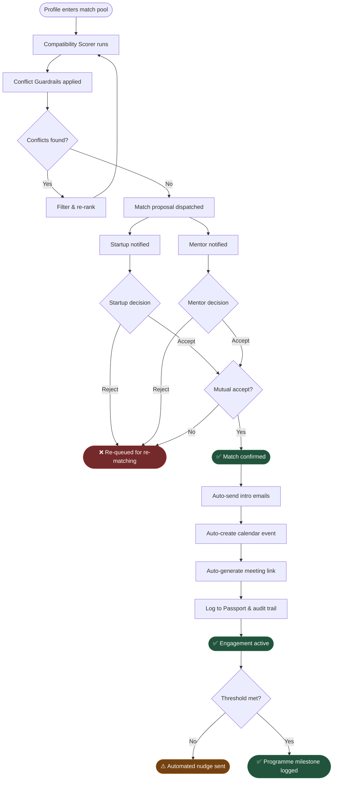

<div align="center">
# Innoweb

**_Ecosystem relationships, automated. Matchmaking, at machine speed._**

[](https://opensource.org/licenses/MIT)
[](https://react.dev)
[](https://www.typescriptlang.org)
[](https://vitejs.dev)
[](https://google.github.io/adk-docs/)
[](https://developers.google.com)
[](https://www.python.org)
[](#)

[How It Works](#how-it-works) · [Architecture](#architecture) · [Quick Start](#quick-start)

`ai-matching` `p2p-ecosystem` `google-adk` `google-apis` `mentor-coordination` `innovation-platform` `automated-workflows` `startup-programs`

---

</div>

# The Problem

Innovation ecosystem platforms have no native coordination layer between _"a participant is onboarded"_ and _"a relationship is actively managed."_ This surfaces in three ways:

**Relationships are one-off.** Mentor-to-company, company-to-programme, and partner-to-initiative linkages are handled as bespoke manual tasks — not reusable, structured system entities. There is no platform memory. Every cohort starts from scratch.

**Admins are the single point of failure.** Every verification, match, and engagement update bottlenecks through one team. A model that works for 20 startups collapses at 200 and breaks entirely across geographies.

**Programs hardcode their coordination.** Platforms bake admin workflows directly into operations:

Every policy change requires an operational intervention. Every programme needs the same admin overhead rebuilt from nothing.

## The Solution

Innoweb lifts coordination _out_ of admin workflows and into programmable, automated platform entities.

The matching engine resolves constraints natively. The intake pipeline self-corrects. Every accepted match triggers a full communication loop with zero human steps. Relationship entities persist across cohorts and improve future matching.

**No admin in the loop. No one-off assignments. No operational ceiling.**

### Without Innoweb vs With Innoweb

| Scenario                    |                Without Innoweb                |                     With Innoweb                     |
| --------------------------- | :-------------------------------------------: | :--------------------------------------------------: |
| Mentor-startup matching     |   ✗ Admin reviews manually, delayed by days   |     ✓ Algorithm scores and dispatches instantly      |
| Conflict of interest checks |      ✗ Admin relies on notes and memory       |    ✓ Engine auto-filters NDAs and sector overlaps    |
| Participant data intake     |  ✗ Admin verifies PDFs, updates master sheet  |   ✓ AI extracts and reconciles with user directly    |
| Post-match communication    | ✗ Admin sends emails and books calendar slots |  ✓ Auto-mail → auto-schedule → auto-meet on Accept   |
| Programme assignment        |    ✗ Admin maps each user to a cohort card    |  ✓ Startups self-select into AI-recommended tracks   |
| Ecosystem health monitoring | ✗ Admin checks backend dashboard periodically |    ✓ Automated alerts fire when engagement drops     |
| Scaling across geographies  |  ✗ Each country needs its own admin overhead  | ✓ Platform infrastructure scales with zero headcount |
| Historical engagement data  |       ✗ Siloed in sheets, never reused        |  ✓ Passport feeds engagement history into matching   |

---

## Use Cases

#### For Startups & Mentors

| Use Case                    | What Innoweb Provides                                                                         |
| --------------------------- | --------------------------------------------------------------------------------------------- |
| Onboarding into a programme | Upload a profile PDF; AI extracts, validates, and builds your Passport automatically          |
| Getting matched             | Receive compatibility-ranked match proposals on your dashboard; accept or reject in one click |
| Post-match communication    | Mutual accept triggers intro email, calendar invite, and meeting link with no admin steps     |
| Programme enrollment        | Browse AI-recommended open tracks and self-select — no approval gate                          |

#### For Programme Owners & Partners

| Use Case                     | What Innoweb Provides                                                                           |
| ---------------------------- | ----------------------------------------------------------------------------------------------- |
| Launching a cohort           | Define parameters and eligibility; the platform handles all participant mapping                 |
| Monitoring engagement        | Real-time dashboard surfaces match rates, active sessions, and stalled relationships            |
| Scaling across programmes    | Relationship entities persist and seed future matching — no rebuild per cohort                  |
| Partner & sponsor management | Self-service portals for partners to manage tiers, perks, and initiative linkages independently |

---

## Features

| Feature                             | Description                                                                                             |
| ----------------------------------- | ------------------------------------------------------------------------------------------------------- |
| **AI P2P Matching Engine**          | Compatibility-scored mentor-startup matching with native conflict resolution — no admin review step     |
| **Self-Correcting Intake**          | Chatbot reconciles missing or ambiguous profile data directly with the user before onboarding completes |
| **Dynamic Passport System**         | Real-time profile that updates on every interaction and feeds back into the matching model              |
| **Automated Communication Loop**    | Mutual accept → auto-email → auto-calendar → auto-meet link, zero human steps                           |
| **Algorithmic Conflict Guardrails** | Pre-match filtering for NDA flags, sector overlaps, and calendar availability                           |
| **Self-Service Programme Tracks**   | AI-recommended open tracks; participants self-enroll without admin mapping                              |
| **Engagement Alerts**               | Automated nudges when a relationship drops below programme engagement thresholds                        |
| **Cross-Programme Reuse**           | Relationship entities persist across cohorts and geographies — institutional memory, not a spreadsheet  |

---

## Architecture

```
┌──────────────────────────────────────────────────────────────┐
│                        CLIENT LAYER                          │
│   Startup Dashboard · Mentor Dashboard · Programme Portal    │
│                  React 18 + TypeScript (Vite)                │
└──────────────────────────────┬───────────────────────────────┘
                               │  REST / WebSocket
┌──────────────────────────────▼───────────────────────────────┐
│                      AGENT LAYER                             │
│              Google Agent Development Kit (ADK)              │
│                                                              │
│   ┌─────────────────┐  ┌──────────────┐  ┌───────────────┐  │
│   │ Matching Engine │  │Intake Service│  │  Comms Service│  │
│   └────────┬────────┘  └──────┬───────┘  └───────┬───────┘  │
└────────────┼─────────────────┼──────────────────┼───────────┘
             │                 │                  │
┌────────────▼─────────────────▼──────────────────▼───────────┐
│                     INTEGRATION LAYER                        │
│        Google Drive API · Google Calendar API · Gmail API    │
│              Google Meet API · AI / Vector Store             │
└──────────────────────────────────────────────────────────────┘
```

**State tree.** An `EcosystemConfig` is a set of `ProgrammeRules`, each holding participant eligibility, conflict constraints, and a compatibility predicate tree. The Google ADK agent layer reads this tree at match-time to score, filter, and dispatch candidates via the Google API integration layer.

```mermaid
graph TD
    Innoweb["🌐 Innoweb Platform"]

    Innoweb --> MatchingEngine["Matching Engine"]
    Innoweb --> IntakePipeline["Intake Pipeline"]
    Innoweb --> PassportSystem["Passport System"]
    Innoweb --> CommunicationHub["Communication Hub"]
    Innoweb --> ProgrammeLayer["Programme Layer"]

    MatchingEngine --> ConflictGuardrails["Conflict Guardrails"]
    MatchingEngine --> CompatibilityScorer["Compatibility Scorer"]
    MatchingEngine --> MatchProposal["Match Proposal Dispatcher"]

    IntakePipeline --> AIValidator["AI Data Validator"]
    IntakePipeline --> ChatbotReconciler["Chatbot Reconciler"]
    IntakePipeline --> DataExtractor["Auto Data Extractor"]

    PassportSystem --> ProfileBuilder["Profile Auto-Builder"]
    PassportSystem --> EngagementLogger["Engagement Logger"]

    CommunicationHub --> AutoMail["Auto-Mail"]
    CommunicationHub --> AutoSchedule["Auto-Schedule"]
    CommunicationHub --> AutoMeet["Auto-Meet Link"]
    CommunicationHub --> EngagementAlerts["Engagement Alerts"]

    ProgrammeLayer --> TrackSelector["AI Track Recommender"]
    ProgrammeLayer --> AuditTrail["Match Audit Trail"]
    ProgrammeLayer --> HealthDashboard["Ecosystem Health Dashboard"]

    style Innoweb fill:#1a202c,stroke:#4a5568,color:#fff
    style MatchingEngine fill:#2d3748,stroke:#4a5568,color:#fff
    style IntakePipeline fill:#2d3748,stroke:#4a5568,color:#fff
    style PassportSystem fill:#2d3748,stroke:#4a5568,color:#fff
    style CommunicationHub fill:#2d3748,stroke:#4a5568,color:#fff
    style ProgrammeLayer fill:#2d3748,stroke:#4a5568,color:#fff
    style ConflictGuardrails fill:#2d3748,stroke:#4a5568,color:#fff
    style CompatibilityScorer fill:#2d3748,stroke:#4a5568,color:#fff
    style MatchProposal fill:#2d3748,stroke:#4a5568,color:#fff
    style AIValidator fill:#2d3748,stroke:#4a5568,color:#fff
    style ChatbotReconciler fill:#2d3748,stroke:#4a5568,color:#fff
    style DataExtractor fill:#2d3748,stroke:#4a5568,color:#fff
    style ProfileBuilder fill:#2d3748,stroke:#4a5568,color:#fff
    style EngagementLogger fill:#2d3748,stroke:#4a5568,color:#fff
    style AutoMail fill:#2d3748,stroke:#4a5568,color:#fff
    style AutoSchedule fill:#2d3748,stroke:#4a5568,color:#fff
    style AutoMeet fill:#2d3748,stroke:#4a5568,color:#fff
    style EngagementAlerts fill:#2d3748,stroke:#4a5568,color:#fff
    style TrackSelector fill:#2d3748,stroke:#4a5568,color:#fff
    style AuditTrail fill:#2d3748,stroke:#4a5568,color:#fff
    style HealthDashboard fill:#2d3748,stroke:#4a5568,color:#fff
```



---

## How It Works

### Onboarding & Intake

```
User uploads profile PDF / Drive link
    ↓
AI Validator checks completeness and integrity
    ↓
Flagged? → Chatbot reconciles directly with the user
    ↓
Auto-extract and normalize all fields
    ↓
Passport created and added to the match pool
    ↓
✓ Profile live — matching engine begins scoring
```

### Matching & Communication Flow



---

# React + TypeScript + Vite

This template provides a minimal setup to get React working in Vite with HMR and some ESLint rules.

Currently, two official plugins are available:

- [@vitejs/plugin-react](https://github.com/vitejs/vite-plugin-react/blob/main/packages/plugin-react) uses [Oxc](https://oxc.rs)
- [@vitejs/plugin-react-swc](https://github.com/vitejs/vite-plugin-react/blob/main/packages/plugin-react-swc) uses [SWC](https://swc.rs/)

## React Compiler

The React Compiler is not enabled on this template because of its impact on dev & build performances. To add it, see [this documentation](https://react.dev/learn/react-compiler/installation).

## Expanding the ESLint configuration

If you are developing a production application, we recommend updating the configuration to enable type-aware lint rules:

```js
export default defineConfig([
  globalIgnores(["dist"]),
  {
    files: ["**/*.{ts,tsx}"],
    extends: [
      // Other configs...

      // Remove tseslint.configs.recommended and replace with this
      tseslint.configs.recommendedTypeChecked,
      // Alternatively, use this for stricter rules
      tseslint.configs.strictTypeChecked,
      // Optionally, add this for stylistic rules
      tseslint.configs.stylisticTypeChecked,

      // Other configs...
    ],
    languageOptions: {
      parserOptions: {
        project: ["./tsconfig.node.json", "./tsconfig.app.json"],
        tsconfigRootDir: import.meta.dirname,
      },
      // other options...
    },
  },
]);
```

You can also install [eslint-plugin-react-x](https://github.com/Rel1cx/eslint-react/tree/main/packages/plugins/eslint-plugin-react-x) and [eslint-plugin-react-dom](https://github.com/Rel1cx/eslint-react/tree/main/packages/plugins/eslint-plugin-react-dom) for React-specific lint rules:

```js
// eslint.config.js
import reactX from "eslint-plugin-react-x";
import reactDom from "eslint-plugin-react-dom";

export default defineConfig([
  globalIgnores(["dist"]),
  {
    files: ["**/*.{ts,tsx}"],
    extends: [
      // Other configs...
      // Enable lint rules for React
      reactX.configs["recommended-typescript"],
      // Enable lint rules for React DOM
      reactDom.configs.recommended,
    ],
    languageOptions: {
      parserOptions: {
        project: ["./tsconfig.node.json", "./tsconfig.app.json"],
        tsconfigRootDir: import.meta.dirname,
      },
      // other options...
    },
  },
]);
```
